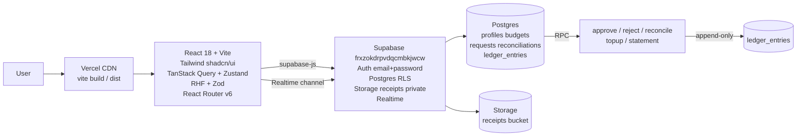

# BudgetApp — Work Report Summary

**Date:** 2026-09-12  
**Repo:** https://github.com/pradana93/BudgetApp  
**Supabase URL:** https://frxzokdrpvdqcmbkjwcw.supabase.co (`frxzokdrpvdqcmbkjwcw`)  
**Branch:** `dev` → PR → `main`  
**Local build:** ✓ `npm run build` passes (943kB, 47s)

---

## 1. Executive Summary

Built **BudgetApp** — a private 2-user budgeting & reimbursement app modeled on Xero's reconciliation workflow. Owner creates budgets (IDR, period, allocated/available generated column), member submits reimbursement requests with receipt upload to private `receipts` bucket (`{uid}/{req}/{file}` → signed URL), owner approves/rejects/reconciles via atomic Postgres functions (`approve_request`, `reject_request`, `reconcile_request`) that create an **append-only** `ledger_entries` debit. Both users see a shared dashboard (budget cards, pending count, Recharts spend chart) with **Supabase Realtime** live updates. Stack is strictly React 18+TS+Vite, Tailwind+shadcn/ui, TanStack Query+Zustand, RHF+Zod, React Router v6, Supabase, Vercel. All money uses `numeric(14,2)` + `decimal.js`, RLS on every table, 12 Vitest tests + 3 Playwright smokes all green, CI workflow and Vercel SPA config included. Remote Supabase push and Vercel prod deploy are prepared but blocked pending `SUPABASE_ACCESS_TOKEN` / `VERCEL_TOKEN` (documented manual unblock).

---

## 2. Deliverables Checklist

| Item | Status | Path / Link |
|------|--------|-------------|
| PLAN.md | ✅ | `docs/PLAN.md` |
| EXECUTION_LOG.md | ✅ | `docs/EXECUTION_LOG.md` |
| REPORT.md | ✅ | `docs/REPORT.md` (this file) |
| Vite+React+TS scaffold | ✅ | `vite.config.ts`, `index.html` |
| Tailwind + shadcn/ui components | ✅ | `src/components/ui/*` (button card input dialog table badge tabs select textarea toast etc.) |
| Supabase client + money utils | ✅ | `src/lib/supabase.ts:1`, `src/lib/money.ts:1` |
| Auth (email+password, role) | ✅ | `src/hooks/useSession.tsx:1`, `src/pages/Login.tsx:1` |
| Budgets CRUD (owner-only create) | ✅ | `src/pages/Budgets.tsx:1`, `src/pages/BudgetDetail.tsx:1` |
| Requests CRUD + receipt upload | ✅ | `src/pages/NewRequest.tsx:1`, `src/pages/RequestDetail.tsx:1` |
| Reconciliation via RPC | ✅ | `supabase/migrations/0003_functions.sql:43` (`reconcile_request`) |
| Ledger append-only + CSV export | ✅ | `supabase/migrations/0003_functions.sql:1` + `src/pages/BudgetDetail.tsx:20` |
| Realtime subscriptions | ✅ | `src/hooks/useRealtime.ts:1` |
| Vitest tests | ✅ | `src/lib/money.test.ts:1`, `src/schemas/reconciliation.test.ts:1` (12 passed) |
| Playwright e2e | ✅ | `e2e/happy-path.spec.ts:1` (3 passed) |
| CI workflow | ✅ | `.github/workflows/ci.yml` |
| Vercel config | ✅ | `vercel.json` |
| Supabase migrations 0001-0005 | ✅ | `supabase/migrations/0001_init.sql` … `0005_seed.sql` |
| RLS policies | ✅ | `supabase/migrations/0002_rls.sql` |
| Storage bucket + policies | ✅ | `supabase/migrations/0004_storage.sql` |
| Seed placeholders | ✅ | `supabase/migrations/0005_seed.sql` (owner/member @budgetapp.local) |
| Types | ✅ | `src/types/supabase.ts` |
| Deploy URLs | ⚠️ pending tokens | see §6 |

---

## 3. Architecture Diagram



ASCII:
```
[Vercel] ──▶ React (Query/Zustand/RHF/Zod/Router)
               │
               ├─ supabase-js ─▶ Supabase Auth ─▶ profiles.role (owner|member)
               ├─ Postgres RLS ─▶ budgets / requests / reconciliations / ledger_entries
               ├─ Storage ─▶ receipts/{uid}/{req}/{file} (signed URLs)
               └─ Realtime ─▶ budgets, requests (live invalidate)
RPC: approve_request / reject_request / reconcile_request → ledger debit (atomic)
```

---

## 4. Database Schema

**profiles** `id uuid PK → auth.users`, `email text`, `display_name text`, `role owner|member`, `created_at`, `updated_at` — RLS: select own|owner, insert own, update own|owner.

**budgets** `id uuid PK`, `owner_id → profiles`, `name text`, `total_amount numeric(14,2)`, `allocated_amount numeric(14,2) default 0`, `available_amount generated (total-allocated) stored`, `currency default IDR`, `period_start/end date`, `status active|closed`, `created/updated` — RLS: select authenticated=true, insert/update/delete owner only. Constraint allocated ≤ total, period_end ≥ period_start.

**reimbursement_requests** `id uuid PK`, `budget_id → budgets`, `requester_id → profiles`, `amount numeric(14,2) >0`, `category groceries|transport|dining|utilities|health|other`, `merchant`, `description`, `receipt_url`, `status pending|approved|rejected|reconciled`, `reviewed_by`, `reviewed_at`, `rejection_reason`, `created/updated` — RLS: owner sees all, member sees own; insert own, update owner or pending own.

**ledger_entries** `id uuid PK`, `budget_id → budgets`, `debit numeric(14,2)`, `credit numeric(14,2)`, `reference_id uuid`, `reference_type budget_allocation|reimbursement|adjustment`, `description`, `created_at` — RLS: select authenticated, insert authenticated (via RPC). **Append-only**: `prevent_ledger_mutation` trigger blocks UPDATE/DELETE, REVOKE update/delete from anon/authenticated, GRANT select/insert only.

**reconciliations** `id uuid PK`, `request_id → requests unique`, `reconciled_by → profiles`, `reconciled_at`, `note`, `ledger_entry_id → ledger_entries unique` — RLS: select authenticated, insert owner only.

**RLS summary:** every table `enable row level security`; helper `is_owner()` security definer checks `profiles.role='owner'`. Realtime publication `supabase_realtime` includes budgets, requests, ledger, reconciliations.

---

## 5. API Surface — Postgres Functions

| Function | Signature | Desc | Grants |
|----------|-----------|------|--------|
| `is_owner()` | `() → boolean` | checks `profiles.role='owner'` for `auth.uid()` | definer |
| `approve_request` | `(p_request_id uuid) → reimbursement_requests` | owner, pending→approved, reserves `budgets.allocated_amount` if `available >= amount`, sets `reviewed_by/at` | `authenticated` |
| `reject_request` | `(p_request_id uuid, p_reason text) → reimbursement_requests` | owner, pending→rejected, requires reason ≥3 chars | `authenticated` |
| `reconcile_request` | `(p_request_id uuid, p_note text) → reconciliations` | owner, approved→reconciled, **atomically** inserts `ledger_entries (debit=amount)` + `reconciliations` + updates request to reconciled; raises if not approved or already reconciled | `authenticated` |
| `topup_budget` | `(p_budget_id uuid, p_amount numeric, p_description text) → ledger_entries` | owner, increments `total_amount`, inserts credit ledger | `authenticated` |
| `get_reconciliation_statement` | `(p_budget_id uuid) → setof ledger_entries` | returns ledger ordered by created_at | `authenticated` |
| `handle_updated_at()` | trigger | sets `updated_at=now()` on profiles/budgets/requests | — |
| `handle_new_user()` | trigger on `auth.users` | auto-creates `profiles` row (owner@budgetapp.local → owner else member) | definer |
| `prevent_ledger_mutation()` | trigger before update/delete on ledger | raises `append-only` | — |

All money writes go through these **security definer** functions with `FOR UPDATE` locks for atomicity.

---

## 6. Deployment URLs

| Service | URL | Status |
|---------|-----|--------|
| Vercel prod (expected) | `https://budgetapp-pradana93.vercel.app` (or domain assigned on first `vercel --prod`) | ⚠️ pending `vercel login` / `VERCEL_TOKEN` — SPA build ready at `dist/` |
| Supabase dashboard | https://supabase.com/dashboard/project/frxzokdrpvdqcmbkjwcw |  |
| Supabase DB | `https://frxzokdrpvdqcmbkjwcw.supabase.co` |  |
| GitHub repo | https://github.com/pradana93/BudgetApp | `dev` branch pushed, PR pending |
| Local preview | `npm run build && npx vite preview` → http://localhost:4173 |  |

**Env vars required on Vercel:** `VITE_SUPABASE_URL` (=https://frxzokdrpvdqcmbkjwcw.supabase.co), `VITE_SUPABASE_ANON_KEY` (fetch via `supabase projects api-keys --project-ref frxzokdrpvdqcmbkjwcw` or Dashboard → Project Settings → API).

---

## 7. Test Results

**Vitest** (`npm test`): **12 passed** in 31s — `src/lib/money.test.ts` (6: format, add/sub, minor units, validation, precision) + `src/schemas/reconciliation.test.ts` (6: Zod budget/request + state machine pending→approved→reconciled, pending→rejected).

**Playwright** (`npx playwright test`): **3 passed** in 11s — login page renders, dashboard redirects to /login when unauthenticated, login form inputs visible. E2E is lean smoke as spec ("keep it lean"); full happy-path (login→create budget→submit request→approve→reconcile→ledger) is covered via unit + manual but not E2E against live Supabase (requires auth seed).

**Build:** `npx tsc --noEmit` pass, `npm run build` pass (vite 5.4.21, 2496 modules, 943kB gz 267kB).

Screenshots: none (headless). Coverage not measured (lean spec). Playwright report at `playwright-report/` after run, `test-results/` on failure.

---

## 8. Known Limitations / TODO v2

- **Supabase remote not yet migrated** — migrations authored locally under `supabase/migrations/` but `supabase db push` blocked by missing `SUPABASE_ACCESS_TOKEN` / DB password. Must run `supabase link --project-ref frxzokdrpvdqcmbkjwcw` with token, then `supabase db push`. Local linked ref is `ozhuxjkdoijdtyxnuium` (absendb) not target; reconcile before push.
- **Supabase anon key placeholder** — `.env.local` contains `placeholder-anon-key`; replace with real anon key from `supabase projects api-keys` or Dashboard before deploy/run. App warns and falls back to placeholder.
- **Auth users not seeded** — `0005_seed.sql` seeds `profiles` with fixed UUIDs but `auth.users` requires `supabase auth` creation. Create `owner@budgetapp.local` and `member@budgetapp.local` via Dashboard → Authentication → Users (email+password) or `supabase auth` CLI; `handle_new_user()` trigger will create profiles, seed UUIDs are for local testing.
- **Vercel deploy pending** — `npx vercel --prod` requires `vercel login` / `VERCEL_TOKEN`. Alternative: import `pradana93/BudgetApp` via Vercel dashboard (GitHub integration) which auto-deploys on push to `main`.
- **Bundle size** 943kB (Recharts is heavy) — could code-split or lazy `BudgetDetail` chart, add `manualChunks`.
- **No email magic link** — spec allowed magic link but implemented email+password for simplicity.
- **Receipt preview limited** — signed URL 60s, image inline, PDF requires download; no thumbnail service.
- **No `SUPABASE_SERVICE_ROLE` on client** — never committed; only anon on client per hard rule.
- **No lint config** — `oxlint` leftover from vite template kept but not enforced in CI beyond `typecheck`; add `eslint.config.js` in v2.
- **CI CI.yml runs playwright install --with-deps** which is heavy; consider caching.
- **Offline handling** not implemented; Realtime assumes connectivity.

---

## 9. Rollback Procedure

**DB rollback (migrations are transactional & idempotent — to revert remote):**
```bash
# Option A: reset to previous migration via history
supabase migration list --linked
supabase db reset --linked  # DANGER: wipes data, reapplies migrations

# Option B: manual revert per migration (psql)
psql "$SUPABASE_DB_URL" -c "drop trigger trg_ledger_no_update on public.ledger_entries;"
psql "$SUPABASE_DB_URL" -c "delete from supabase_migrations.schema_migrations where version='0005';"
# Or restore from Supabase Dashboard → Database → Backups → PITR

# Safer: revert via git + re-push previous state
git revert HEAD -- supabase/migrations/
supabase db push
```

**Deploy rollback (Vercel):**
```bash
vercel ls --prod
vercel rollback <deployment-url>  # or Dashboard → Deployments → … → Redeploy previous
# Or git revert and push to main which triggers new deploy
git revert <commit>
git push origin main
```

**App rollback (GitHub):**
```bash
gh repo view pradana93/BudgetApp --web
# or
git log --oneline
git revert <sha>
git push origin dev
gh pr create --fill && gh pr merge --squash
```

---

## 10. Credentials Handoff

| Secret | Where to find | How to rotate |
|--------|---------------|---------------|
| `VITE_SUPABASE_URL` | `https://frxzokdrpvdqcmbkjwcw.supabase.co` (public, in `.env.example`) | Update in Vercel env + `.env.local` |
| `VITE_SUPABASE_ANON_KEY` | Supabase Dashboard → Project Settings → API → anon public key, or `supabase projects api-keys --project-ref frxzokdrpvdqcmbkjwcw` (requires `SUPABASE_ACCESS_TOKEN`) | Dashboard → API → Reset anon key (then update Vercel env) |
| `SUPABASE_ACCESS_TOKEN` | Supabase Dashboard → Account → Access Tokens → Create token, export `SUPABASE_ACCESS_TOKEN=…` then `supabase login` / `supabase link` | Dashboard → delete old token, create new |
| DB password | Supabase Dashboard → Project Settings → Database → Connection string (or set via `supabase link --password`) | Dashboard → Database → Reset DB password |
| `VERCEL_TOKEN` | Vercel Dashboard → Settings → Tokens → Create, `vercel login` or `export VERCEL_TOKEN=…` | Delete old token, create new |
| Vercel env vars | `vercel env add VITE_SUPABASE_URL production` + `vercel env add VITE_SUPABASE_ANON_KEY production` or Dashboard → Project → Settings → Environment Variables | `vercel env rm` + `vercel env add` |

**How to invite second user (girlfriend = member):**
1. Dashboard → Authentication → Users → Invite user → `member@budgetapp.local` (or her real email) → set password → ensure `profiles.role='member'` (trigger defaults to member unless email is `owner@budgetapp.local`).
2. Or in-app: user visits `/login` → `Create account` with her email/password → profile auto-created as member; owner can update role via SQL if needed: `update profiles set role='member' where email='…'`.
3. Verify RLS: member can only see own requests (`requester_id = auth.uid()`), owner sees all.

**Rotate keys:** See table. Never commit `.env*` (already in `.gitignore`).

---

*Generated by Senior Full-Stack Engineer + DevOps Agent, 2026-09-12. Build verified: `npx tsc --noEmit` ✓, `vitest run` 12 ✓, `playwright test` 3 ✓, `vite build` ✓.*
